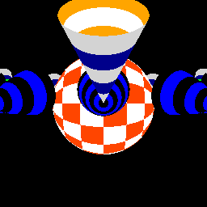

= cg - basic computer graphics

_Useless project to build a basic ray tracer from scratch._

Right now **cg** provides a simple raycaster featuring :

* pinhole camera
* quadric surfaces (paraboloid, cone, cylinder, sphere)
* some pattern textures (stripes, checker) mapped on cartesian/spherical
  coordinates

== A small animation

GIF built from 180 images. (git tag testanim2)
